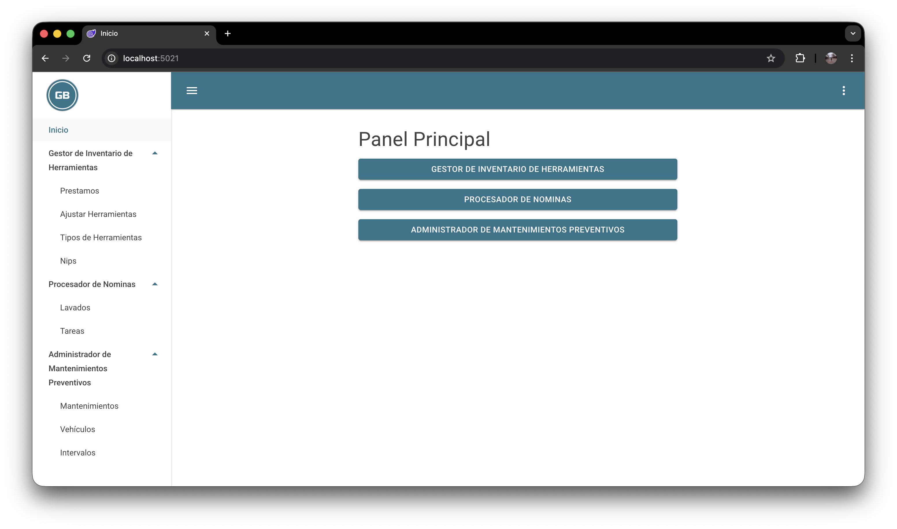
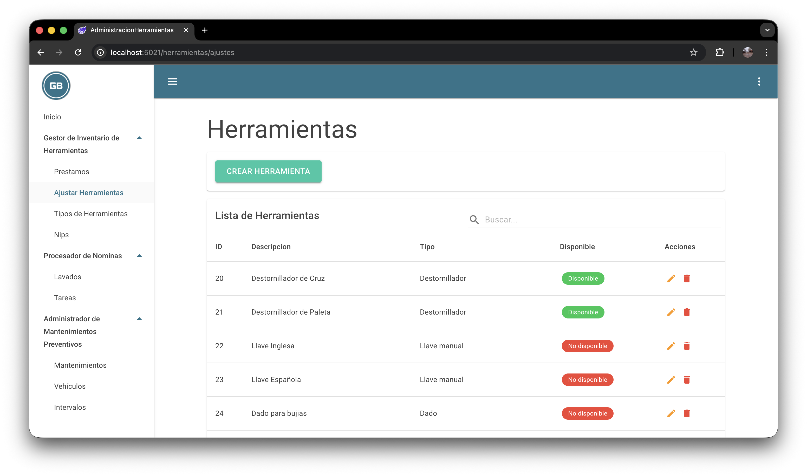
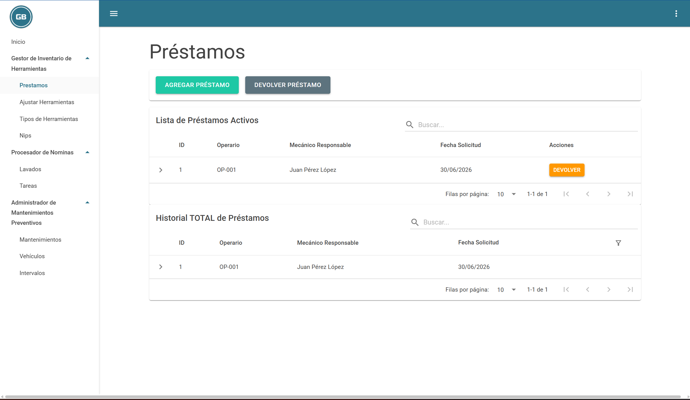
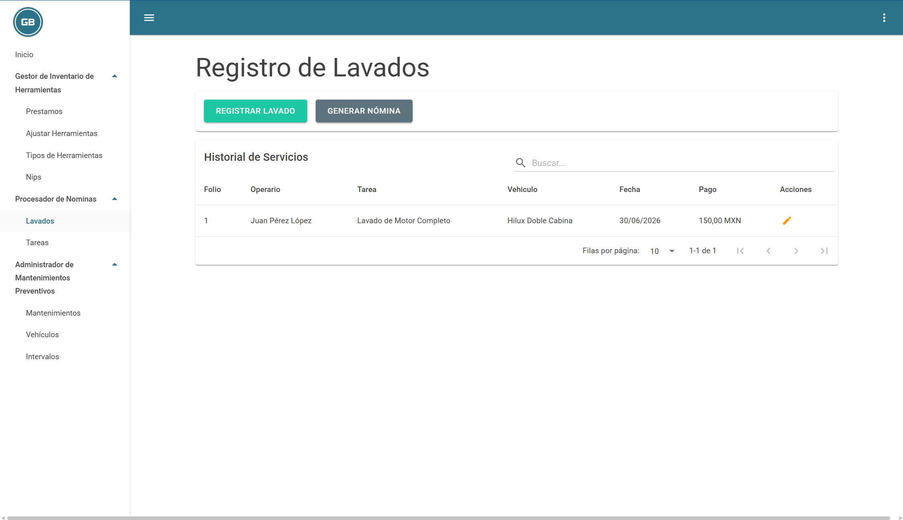
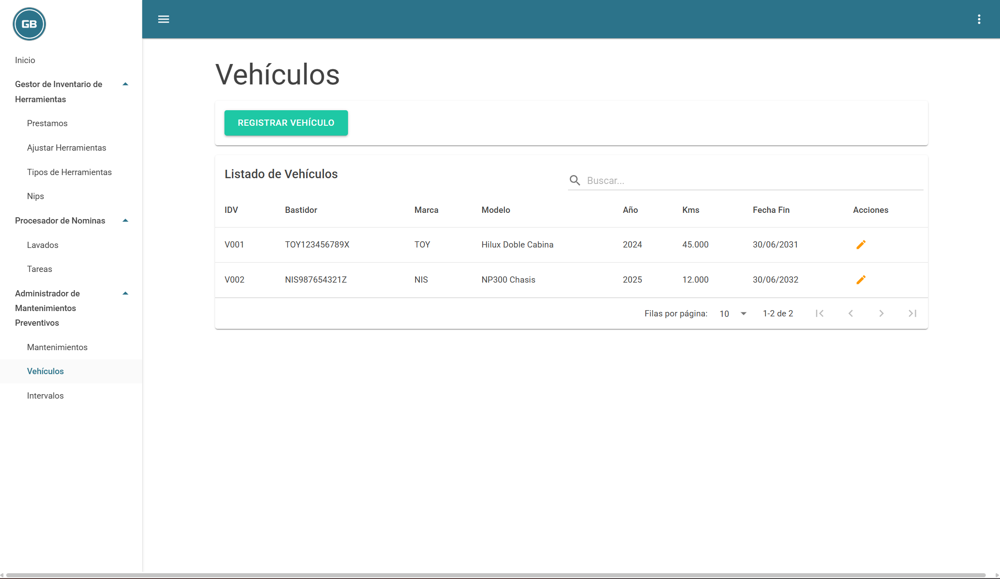
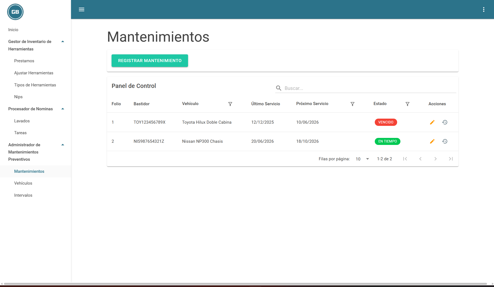

AdminHerramientas

A tool inventory, employee tool-lending, and vehicle maintenance management system for an automotive workshop. Built with Blazor WebAssembly, .NET 7, Entity Framework Core, and SQL Server, fully containerized with Docker.

## Core Modules & Features
## Menu
<p align="center">
  
</p>

## 1. Tool Management & Loan Control
<p align="center">
  
  
</p>

### 2. Vehicle Washing & Commission Tracking
<p align="center">
  
</p>

### 3. Fleet Maintenance & Interval Alerts
<p align="center">
  
  
</p>


## Tech Stack

| Layer | Technology |
|---|---|
| Frontend | Blazor WebAssembly |
| Backend | ASP.NET Core 7 (Web API) |
| ORM | Entity Framework Core 7 |
| Database | SQL Server 2022 |
| Containers | Docker / Docker Compose |

Prerequisites

Docker and Docker Compose installed
(Optional, only for local development without Docker) .NET 7 SDK


How to Run It

1. Clone the repository

```bashgit
clone https://github.com/BrandonFornes/MPGBA.git
```
```bash
cd AdminHerramientas
```

2. Create the environment variables file

Create a .env file in the project root (same level as docker-compose.yml) with the following content:
```bash
DB_PASSWORD=YourSecurePassword123!
```
The password must meet SQL Server's complexity requirements (minimum 8 characters, including uppercase, lowercase, numbers, and symbols).

3. Build and start the containers

```bash
docker-compose up --build
```

This will build the application image, start SQL Server, automatically apply EF Core migrations, and seed the database with sample data.

4. Access the application

Once the containers are up and running, open your browser at:

http://localhost:8080

## Local Development (without Docker)

If you prefer to run the backend directly with the .NET SDK 
you will need:

- [.NET 7 SDK](https://dotnet.microsoft.com/download/dotnet/7.0)
- A SQL Server instance running locally on port 1433

The easiest way to get SQL Server locally is to spin up 
only that container:

```bash
docker-compose up sqlserver
```

Then in a separate terminal, set your connection string 
via User Secrets and run the app:

```bash
cd Server
dotnet user-secrets init
dotnet user-secrets set "ConnectionStrings:DefaultConnection" \
  "Server=localhost,1433;Database=ALP;User Id=sa;\
  Password=YourSecurePassword123!;TrustServerCertificate=True;"
dotnet run
```
Project Structure

## Project Structure

```
AdminHerramientas/
├── Client/      # Blazor WebAssembly project (frontend)
├── Server/      # ASP.NET Core API, EF Core, migrations
├── Shared/      # Models shared between Client and Server
├── Dockerfile
├── docker-compose.yml
└── README.md
```
